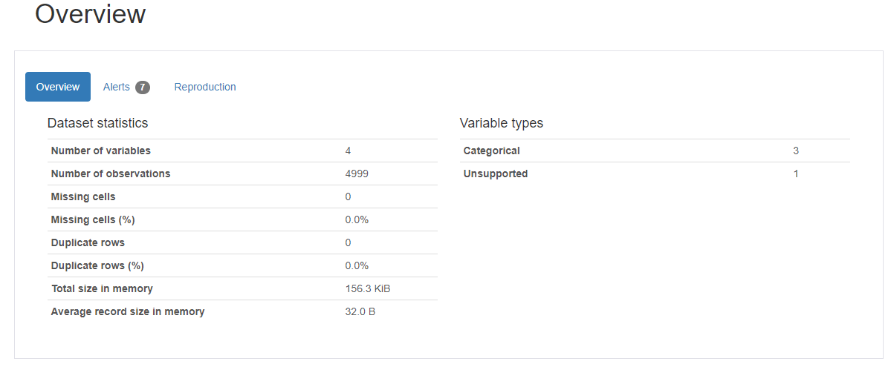
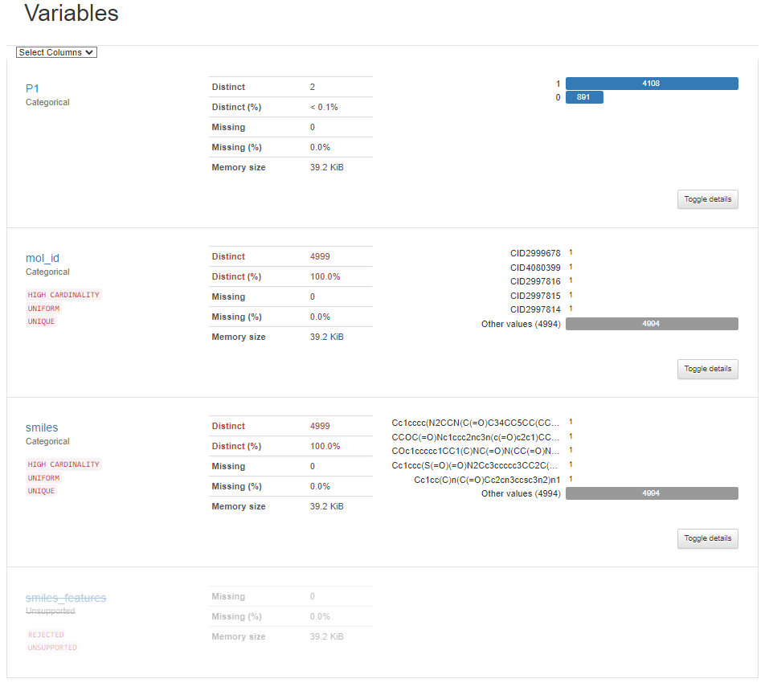
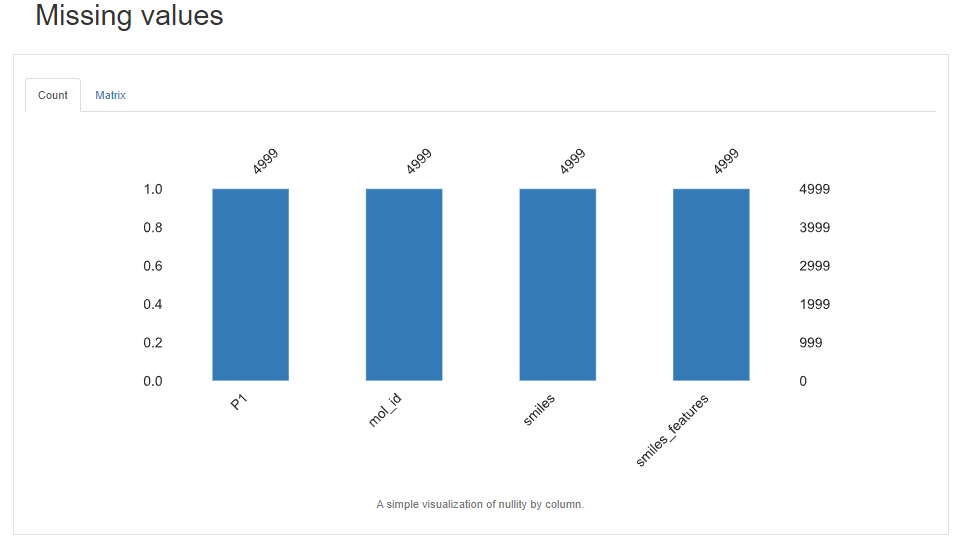
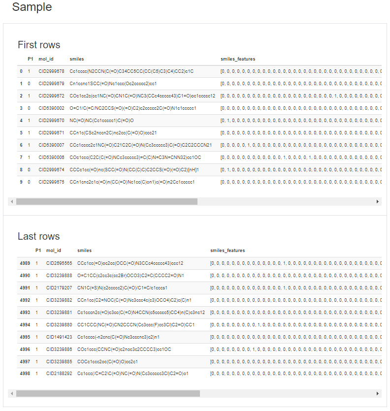

# data_science_technical_test

**Table of content**

- [Documentation](#documentation)
  - [Objectif :](#objectif-of-this-project-)
- [Data Exploration](#data-exploration)

# Documentation
## Context - What do you learn in this project?
The prediction of a drug molecule properties plays an important role in the drug design process. The molecule properties are the causeof failure for 60% of all drugs in the clinical phases. A multi parameters optimization using machine learning methods can be used tochoose an optimized molecule to be subjected to more extensive studies and to avoid any clinical phase failure.

So, the objective of this exercise is to develop a deep learning model to predict one or more basic properties of a molecule.

This project predict basic molecule's properties, from its fingerprint features, using deep learning

- Setup python environment using `miniconda`
- Parse argument from the CLI
- Load a dataset and perform feature extraction
- Split the dataset
- Train a classification machine learning model
- Save the pretrained model
- Predict the molecule properties using pretrained model
- Evaluate the model
- Package the app inside a docker image
- Access the `predict` method via a `Flask` API
- Documentation

# Data Exploration

`dataset_single.csv`

```python
    P1	mol_id	    smiles
0	1	CID2999678	Cc1cccc(N2CCN(C(=O)C34CC5CC(CC(C5)C3)C4)CC2)c1C
1	0	CID2999679	Cn1ccnc1SCC(=O)Nc1ccc(Oc2ccccc2)cc1
2	1	CID2999672	COc1cc2c(cc1NC(=O)CN1C(=O)NC3(CCc4ccccc43)C1=O...
3	0	CID5390002	O=C1/C(=C/NC2CCS(=O)(=O)C2)c2ccccc2C(=O)N1c1cc...
4	1	CID2999670	NC(=O)NC(Cc1ccccc1)C(=O)O
```

1. Overview of our data
   
2. Variable of our data
   
3. Check missing values of our data
   
4. Samples of our data
   


# Project Structure

This project is organized as follow

```
.
├── api
│   ├── cli.py
│   ├── data
│   │   ├── dataset_multi.csv
│   │   ├── dataset_single.csv
│   │   └── dataset_single_folds.csv
│   ├── __init_.py
│   ├── media
│   │   ├── P1.png
│   │   ├── test_api.png
│   │   ├── test_flask.png
│   │   └── test_terminal.png
│   ├── models
│   │   ├── entire_model_1.pt
│   │   ├── entire_model_2.pt
│   │   ├── state_dict_model_1.pt
│   │   └── state_dict_model_2.pt
│   └── src
│       ├── templates
│       │   ├── index.html
│       │   ├── profile_report_data_4_model_model_1.html
│       │   └── profile_report_data_4_model_multi_model_3.py
│       ├── api_flask.py
│       ├── config_file.py 
│       ├── feature_extractor.py
│       ├── main.py
│       ├── model_1.py
│       ├── model_2.py
│       └── model_3.py
├── test
│   ├── __init__.py
│   └── test.py
├── .gitignore
├── Cloud_Environment_Questions_Answers.pdf
├── Dockerfile
├── LICENCE
├── README.md
├── run_flask_api.sh
├── servier.yaml
└── setup.py
```
